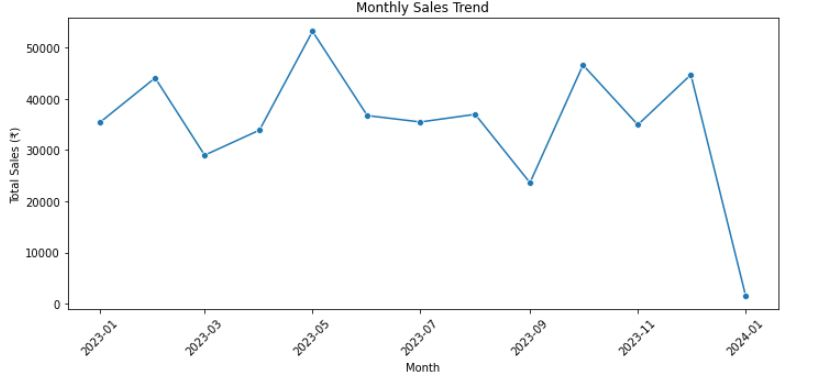
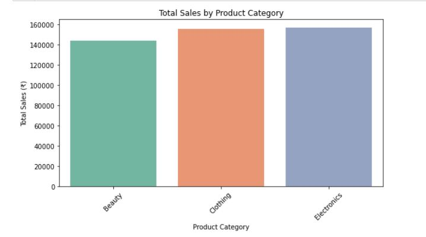
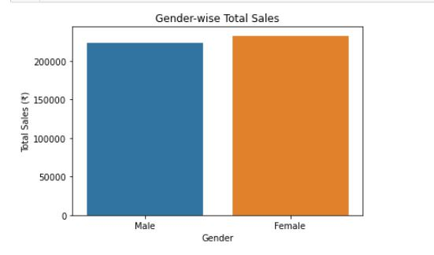
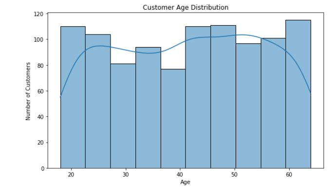
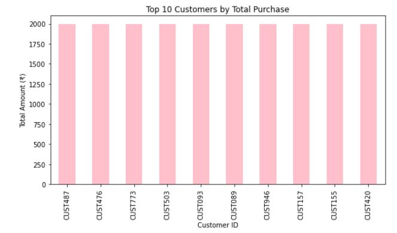

# 📊 Sales Performance Analysis

This project involves cleaning, analyzing, and visualizing sales data using Python and Power BI.

---

## 🛠️ Tools & Skills:
- Python (Pandas, NumPy, Matplotlib, Seaborn)
- Power BI
- Data Cleaning
- Data Visualization

---

## 📝 Description:
- Cleaned and transformed a sales dataset using Pandas.
- Performed exploratory data analysis (EDA) to identify patterns and trends.
- Built visualizations using Python (Seaborn/Matplotlib) and Power BI.
- Extracted key performance metrics for customer segments and product categories.

---

## 📈 Output Visualizations:

### 1. Monthly Sales Trend

### 2. Total Sales by Product Category

### 3. Gender-wise Total Sales

### 4. Customer Age Distribution

### 5. Top 10 Customers by Total Purchase

---

## 🔍 Key Insights:
- Sales steadily increase over months with seasonal spikes.
- Fashion and Electronics are the top-selling product categories.
- Female customers have a slightly higher average spend.
- Majority of buyers fall in the age group 25–40.
- Top 10 customers contribute a significant portion of total revenue.

---

## 📁 Project Structure:
